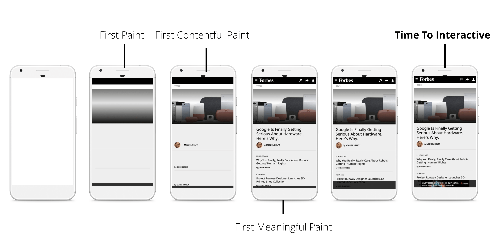

RAIL is a User-centric performance model that breaks down the user's experience into key actions.

Every web app has four distinct aspects to its life cycle, and performance fits into them in different ways.

### User Perception

User perception of performance delays:

| Delay           | Perception                                                   |
| --------------- | ------------------------------------------------------------ |
| 0 to 16ms       | Browser paint 60 frames to screen every second, leaving about 10ms for app to produce a frame. |
| 0 to 100ms      | Users feel like the result are immediate.                    |
| 100ms to 300ms  | A slightly perceptible delay.                                |
| 300ms to 1000ms | Users feel part of a natural and continuous progression of tasks, like loading page or changing views. |
| 1000ms or more  | User lose focus on the task that is performing.              |
| 10s or more     | User are frustrated and likely to abandon tasks.             |

### Response

__Process events in under 50ms.__

Don't block the user, work in the background if possible.

Actions that takes more than 50ms need to provide feedback.

Idle tasks affect the input response budget.

### Animation

__Produce a frame in 10ms__

Whenever possible, make use of the 100ms response budget to pre-calculate expensive work so that you maximize your chances of hitting 60fps.

All interactions are considered animation:

1. Visual aniamtions, such as loading indicators, tweening, entrance and exit.
2. Scrolling, such as flinging, as the page continue to scroll after user lets go scorlling.
3. Dragging, such as dragging a map or pinching to zoom.

More to see: [Rendering Performance](https://silentmaker.github.io/blog/rendering-performance)

### Idle

__Maximize idle time__ to increase the odds that the page responds to user input within 50ms.

1. Use idle time to do deffered work, like loading a page with minium data and get the rest afterwards.
2. Idle time tasks should be perform within 50ms or less.
3. User interactions should have highest priority and interrupt the idle time task.

### Load

__Deliver content and become interactive in under 5 seconds__

When pages load slowly, user attention wanders, and users perceive the task as broken. Sites that load quickly have longer average sessions, lower bounce rates, and higher ad viewability.

Optimize loading performance relative to the users's network condition and device. 

Currently, a good target for first loads is to load the page and be interactive in 5s or less on mid-range mobile devices (such as Moto G4) with slow 3G connections. 

For subsequent loads, a good target is to load the page in under 2 seconds.

1. Focus on optimizing [Criticl Rendering Path](https://silentmaker.github.io/blog/critical-rendering-path/) to unblock rendering.
2. Enable progressive rendering and do some work in the background. Defer non-essential loads to periods of idle time. 
3. Recognize the factors that affect page load performance: Network speed and latency, Hardware, Cache eviction, L2/L3 caching, Parsing javascript.

### Tools

- Chrome Devtools
- Lighthouse
- WebPageTest

