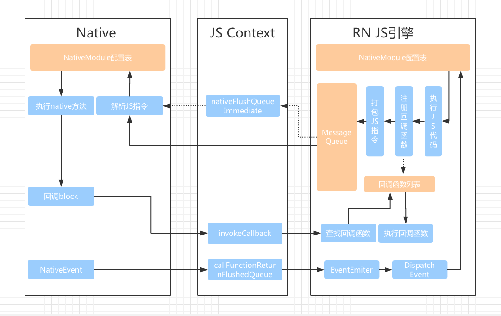
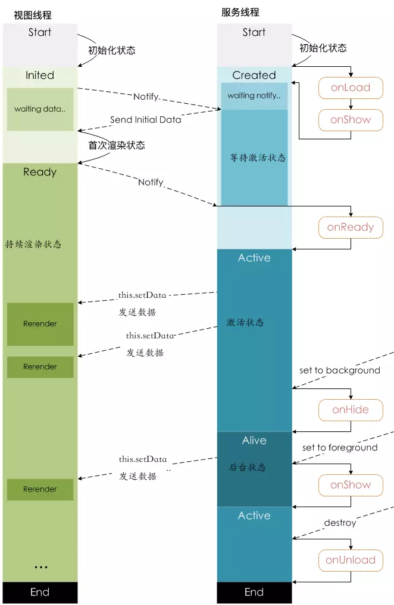

**运行环境**

- 在iOS上，小程序的javascript代码是运行在 JavaScriptCore 中

- 在Android上，小程序的javascript代码是通过X5内核来解析

- 在 开发工具上， 小程序的javascript代码是运行于 nwjs（原node-webkit）

nw.js 与 Electron 类似，两者都同时提供了 Broswer 和 Node.js 的 runtime 环境，使得开发者即可以编写和操作DOM，同时可以借助 Node.js 来访问操作系统原生API的能力

**通信原理**

小程序的 UI 经由 WKWebView 来渲染，API调用通过 JSBridge 将逻辑结果传递到 webview 做渲染，可以类似地参考 React-Native的实现原理：

**文件结构**

- App由app.js、app.json、app.wxss 组成

- Page由page.js、page.json、page.wxss 和 page.wxml 组成

### 生命周期

**App**

| 钩子     | 描述         | 时间点                             |
| -------- | ------------ | ---------------------------------- |
| onLaunch | 小程序初始化 | 当初始化完成时调用，全局只触发一次 |
| onShow   | 小程序显示   | 启动或从后台进入前台展示时触发     |
| onHide   | 小程序隐藏   | 从前台进入后台时触发               |

**Page**

| 钩子     | 描述             | 时间点                                                       |
| -------- | ---------------- | ------------------------------------------------------------ |
| onLoad   | 页面加载         | 一个页面只调用一次                                           |
| onShow   | 页面显示         | 每次打开页面都会触发                                         |
| onReady  | 页面初次渲染完成 | 一个页面只调用一次，且表示页面已可交互，可进行页面设置，如 *wx.setNavigationBarTitle* |
| onHide   | 页面隐藏         | 当 *wx.navigateTo* 或底部Tab切换时触发                       |
| onUnload | 页面卸载         | 当 *wx.redirectTo* 或 *wx.navigateBack* 时触发               |

### 两类线程

- 界面线程（View Thread） - 负责界面渲染
- 服务线程（Appservice Thread） - 负责数据，服务处理

**界面线程的四类状态**

1. 初始化状态：初始化界面线程所需要的工作，包括工作机制，基本和我们开发者没有关系，等初始化完毕就向 “服务线程”发送初始化完毕信号，然后进入等待传回初始化数据状态。
2. 首次渲染状态：收到“服务线程”发来的初始化数据后（就是 json和js中的data数据），就开始渲染小程序界面，渲染完毕后，发送“首次渲染完毕信号”给服务线程，并将页面展示给用户。
3. 持续渲染状态：此时界面线程继续一直等待“服务线程”通过this.setdata()函数发送来的界面数据，只要收到就重新局部渲染，也因此只要更新数据并发送信号，界面就自动更新。
4. 结束状态

**服务线程五状态**

1. 初始化状态：无需和其他模块交流，跟小程序开发也没多大关联，此阶段就是启动服务线程所需的基本功能，比如信号发送模块。系统的初始化工作完毕，就调用自定义的onload和onshow，然后等待界面线程的“界面线程初始化完成”信号。onload是只会首次渲染的时候执行一次，onshow是每次界面切换都会执行
2. 等待激活状态：接收到“界面线程初始化完成”信号后，将初始化数据发送给“界面线程”，等待界面线程完成初次渲染
3. 激活状态：收到界面线程发送来的“首次渲染完成”信号后，就进入激活状态既程序的正常运行状态，并调用自定义的onReady()函数。此状态下就可以通过 this.setData 函数发送界面数据给界面线程进行局部渲染，更新页面
4. 后台运行状态：如果界面进入后台，服务线程就进入后台运行状态，从目前的官方解读来说，这个状态挺奇怪的，和激活状态是相同的，也可以通过setdata函数更新界面的
5. 结束状态：页面被回收或者销毁、应用被系统回收、销毁时触发

### 更新

小程序冷启动时如果发现有新版本，将会异步下载新版本的代码包，并同时用客户端本地的包进行启动，即新版本的小程序需要等下一次冷启动才会应用上