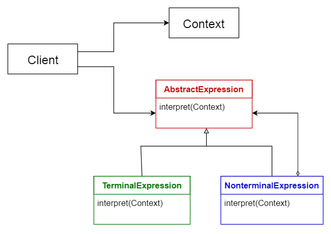

维基百科定义中，架构模式是指：在给定环境中，对常见的软件架构问题的一种通用的、可复用的解决方案，架构模式与设计模式很相似，只是边界范围更明确

- Layered Pattern 层级模式

- Client-Sever Pattern 客户端-服务端模式
- Master-Slave Pattern 主从模式
- Pipe-Filter Pattern 管道模式
- Broker Pattern 经纪人模式
- Peer-to-Peer Pattern 点对点/对等模式
- Event-Bus Pattern 事件总线模式
- Model-View-Controller Pattern 模型-视图-控制器模式
- Blackboard Pattern 黑板模式
- Interpreter Pattern 拦截器模式

### 层级模式（Layered Pattern）

软件架构可以可分解为很多不同的子任务层次时，刚适合此模式，每个层级都代表不同程度的任务抽象，并且每一层都负责像上一层提供服务

通用信息系统中最常见的四个层级如下：

- 表现层/UI层（Presentation Layer / UI Layer）
- 应用层/服务层（Application Layer / Service Layer）
- 业务逻辑层/领域层（Business Logic Layer / Domain Layer）
- 数据接入层/持久层（Data Access Layer / Persistence Layer）

*常用场景*：桌面应用，电商网站应用

*优点*：低的层级可以被不同的高层级调用，只要层级定义清晰，可以很容易做到标准化，层级内的变更不会影响到其他层级

*缺点*：并不是万试万灵；特定情况下有的层级需要被跳过

### 客户端-服务端模式（Client-Sever Pattern）

服务端与客户端是一对多关系，客户端发出对服务的请求，而服务端监听并响应请求

*常用场景*：email，文档在线共享，在线理财

*优点*：很好了模拟了多客户请求多服务的场景

*缺点*：请求一般需要服务端进行多线程处理，用户有多点表征时内部通信管理困难

### 主从模式（Master-Slave Pattern）

主机可以将任务分配到各个从机上，每个从机都是独立、可标识的，主机可以对从机的返回结果进行汇总计算

*常用情景*：数据库的主从同步和读写分离，电脑系统中通过总线接入外部设备

*优点*：准确性 - 服务的执行委托到不同的从机，不同的从机可以有不同的实现

*缺点*：从机是分离的，没有共享状态；主从延时在实时性系统中会造成问题；只适用于解决于可分解的问题

### 管道-过滤器模式（Pipe-Filter Pattern）

此模式适用于处理并生成一系列数据流的软件架构，其中每个处理步骤后都附带一个过滤器组件，数据通过管道来传输，管道可用于缓存或者同步

*常用场景*：编译器（词法分析，转义，语义分析，代码生成等一系列连贯的过滤器），生物信息学中的工作流（如DNA序列分析）

*优点*：可以很好地表现同步处理过程；数据流一产生即可开始处理；增加过滤器非常方便，过滤器可复用并且可以组合成不同的流水线

*缺点*：有短板效应，更换过滤器的时候要管理数据异构

### 经纪人模式（Broker Pattern）
此模式适用于组件解耦化的系统，组件之间可以通过远程服务调用来交互，同时，有一个经纪人组件负责协调组件间的通信，组件将自己的特征和服务等能力信息注册给经纪人，客户端向经纪人请求服务的时候，经纪再根据注册信息将请求重定向到合适的模式

*常用场景*：ActiveMQ、Kafka、RabbitMQ 和 JBoss Messaging

*优点*：支持动态地改动和增删对象，服务分布对开发者而言更透明

*缺点*：必须要对服务描述进行标准化

### 点对点/对等模式（Peer-to-Peer Pattern）
在此模式中，独立组件都是对等的Peer，并且的动态地切换角色，做为客户端时向其他Peer请求服务，做为服务端时可以提供服务

*常用场景*：Gnutella 和 G2 等文档共享网络，P2PTV 和 PDTP 等多媒体协议

*优点*：支持去中心化计算；单点故障时的鲁棒性高；资源和算力的伸缩性比较高

*缺点*：服务的质量无法保障，Peer之间的协作比较脆弱，安全很难保障，性能取决于Peer的数量

### 事件总线模式（Event-Bus Pattern）
此模式主要用于处理事件，主要的组件有如下四种：

- 事件源（Event Source）
- 事件监听器（Event Listener）
- 频道（Channel）
- 事件总线（Event Bus）- 事件源通过向特定频道发布消息，而监听器则订阅了特定的频道，从而得知事件发生

*常用场景*：安卓开发，消息类服务

*优点*：发布者、订阅者和链接都可以很方便地增加；对高分布性的系统来说很有效

*缺点*：系统规模的伸缩性不好，并且所有的消息都必须经过总线

### 模型-视图-控制器模式（Model-View-Controller Pattern）
MVC 模式则是将交互型应用拆分为三部分，使得信息从产生到被用户接收的过程变得更清晰，有利于组件的解耦和复用：

- 模型（Model）包含核心的功能和数据
- 视图（View）向用户展示数据
- 控制器（Controller）处理用户的输入

*常用场景*：Web站点，Web框架

*优点*：同个模型可以有多种视图，并且在运行时动态展示

*缺点*：复杂性增加，用户行为可能会触发很多不必要的更新

### 黑板模式（Blackboard Pattern）
这类模式一般用于已知解决方案不确定的问题，核心的三个组件为：

- 黑板（Blackboard）- 结构性的全局内存，包含了所有可能的解决方案

- 知识源（Knowledge Source）- 带有自身实现的特定模块

- 控制组件（Control Component）- 选择和配置并运行模块

所有的组件都可访问黑板组件，组件可以产生新数据并添加到黑板上，同时，组件也可以通过对知识源的模式匹配在黑板上找到特定类型的数据

*常用场景*：语音识别，车辆识别和追踪，蛋白质结构识别，声纳信号拦截

*优点*：添加新应用很方便，数据空间的拓展也很容易

*缺点*：变更数据空间很难，因为所有的应用都会被影响到；经常需要做同步或者访问限制

### 拦截器模式（Interpreter Pattern）
此模式主要用于在现存软件架构中设计拦截器组件，比如用于识别一种语言的程序中特定的几行语句或者表达式，从而使得语言中的每种符号都能被分类

*常用场景*：数据库查询语言，用于描述通信协议的程序语言pa

*优点*：高度动态化，对用户重编程很友好，拦截器的替换很方便，所以提高了可拓展性

*缺点*：拦截器模式的编程语言一般要比编译的语言慢，性能可能会成为问题